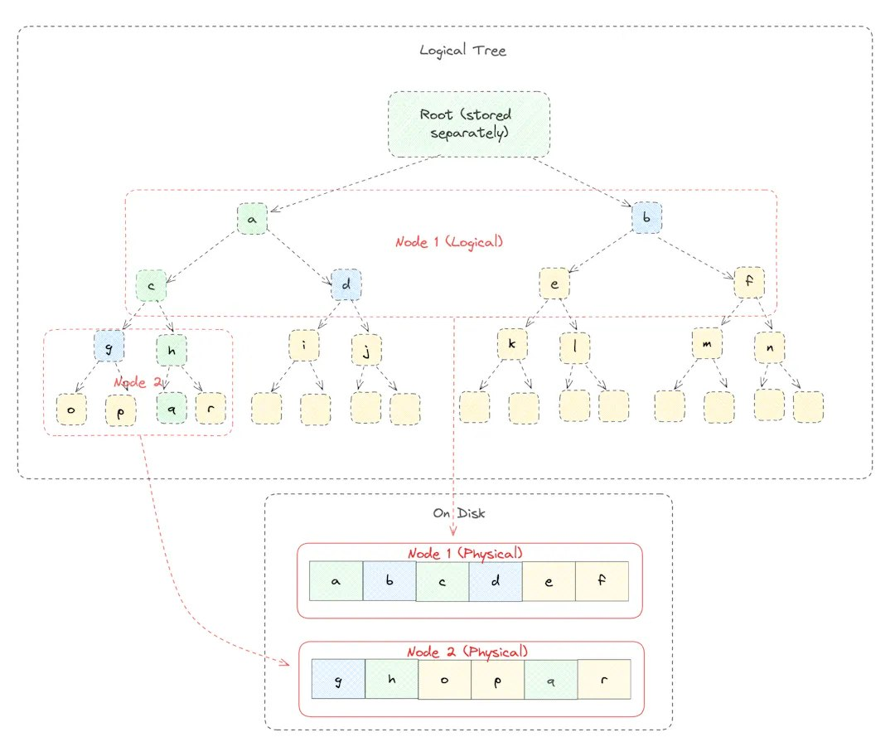
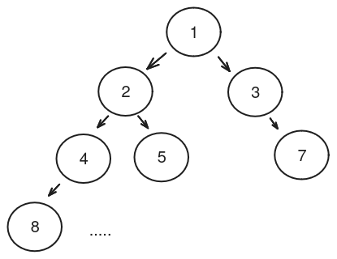

# Nearly Optimal Merkle Trie - Specification

## Tree Structure

NOMT is a Binary Merkle Patricia Trie implementing a key-value mapping from 32 byte keys to
arbitrarily-sized values.

All values within the trie can be committed to with a single small unique identifier.

NOMT is a kind of **Merkle Tree**, where each node's value is computed based on the hashes of the
nodes and values beneath it. This means that the root node accumulates all the information
contained within the tree and serves as a cryptographic commitment to that information.

NOMT is an **Addressable Merkle Trie**, where the path from the root node to the location where a
key's value is stored is based solely upon the key. The trie has 256 levels, each corresponding to
one of the 256 bits of key material, and 2^256 possible nodes at the lowest level.
At the i'th level, whether the value is on the left or right branch is determined by the i'th bit
of the key.

NOMT gives **efficient proofs of inclusion and non-inclusion** and has a schema that is
**optimized for SSDs**.

### Nodes

Each node is exactly 256 bits long. NOMT is general over hash function, and can be used with any
hash function that produces 256 bit hashes.

The Most-Significant Bit (MSB) of each node is used to differentiate the type of node.

There are 3 kinds of nodes.
  1. Internal Nodes. An internal node has 2 child nodes. Its value is given by `hash(left ++ right)`
     with the MSB set to 1. An internal node must either have two leaves as children or at least one
     internal node.
  2. Leaf Nodes. A leaf node encodes a value. Its value is given by `hash(key ++ hash(value))` with
     the MSB set to 0. A leaf node is a stand-in for a sub-trie with a single value.
  3. Terminator Node. A terminator node has the value `0x00....00` and can appear at any level of
     the trie. Terminator nodes are used to stand-in for empty sub-tries: no key whose lookup path
     would reach a terminator has a value within the trie.

Leaf and terminator nodes can be referred to as Terminal nodes, because encountering them terminates
a path lookup.

To avoid ambiguity in representation, sub-tries which have no values or which have a single value
must be represented by a leaf or terminator as close to the root as possible. This rule ensures that
there is only a single valid representation for any key-value set. It also ensures that the trie
is maximally compressed.

##  How is this stored on disk?

### Pages

Nodes will be split into rootless sub-binary trees of depth `d`, so each group will contain `2^(d+1) - 2` nodes.



We will refer to each group as a *Page*. These pages will construct a **page base-(2^d) tree**, where each Page will have `2^d` child pages below it.

### Node Key and PageIds

A node key represents a `path` in the trie, which is called **KeyPath**. The KeyPath is composed of 256 bits, where each bit defines a fork in the node's tree. When seen as an array of bytes, we traverse from the first byte to the last, with each byte being read from the msb to the lsb. For example, if `KeyPath = [0b01001001, 0b00010000]`, the first byte will be `0b01001001` and the first bit to traverse the tree will be `0` (msb), followed by `1` and so on, with the last bit in the byte being `1` (lsb).

Each page contains a rootless sub-binary tree; hence, the KeyPath can be divided into multiple segments that reference the path in the each page sub-tree. These segments are called **d_tets**. For instance, with `KeyPath = [0b01001001, 0b00010000]` and `d = 4`, the `d_tet` will be `[0b0100, 0b1001, 0b0001, 0b0000]`.

Each d_tet specifies the page table to move to next from the previous one, starting from the root page.

If d is a divisor of the key length, there will be `(256/d) - 1` d_tets, each 'd'-bits long; otherwise, there will be `⎣256/d⎦`. This is because the remaining bits are used to traverse the last page and are not required to access any new page.

Each page is assigned a unique identifier (**PageId**) created by the d_tets necessary to reach that page.

###  From KeyPath to Pages

Given a Node Key, we can treat it as an array of bits and split it into `256/d` d\_tets. Iterating over all the d\_tets we will construct each needed PageId to fetch all the Pages that will store the path of the KeyPath.

Let's call `dtets` the array containing all d\_tets and `page_ids` the array of all needed page_ids we want to fill. All PageId will be constructed like this:

```pseudo
    for i in dtets.len()

        if i > 0
             prev_page_id = page_ids[i - 1]
         else
            prev_page_id = 0

        page_ids[i] = (prev_page_id << d) + int(dtets[i]) + 1
```

where `int(dtets[i])` just mean to treat as an integer the sequence of `d` bits and `(prev_page_id << d)` is equal to `(prev_page_id * 2^d)`.

And here's how we can deterministically get the value and all the parent nodes in Merkle from the pages identified by the PageIds extracted from the KeyPath.

### Rootless sub-binary tree in Page

A Page is just an array of bytes that will contain a rootless sub-binary tree, thus an array of Nodes.

#### Node Layout Within Pages

Each node in the rootless sub-binary tree is assigned a position. The root is assigned position 1, and at each subsequent level, the identifiers increase from left to right. For example:



A node at position `p` in the tree will be stored in the array at index `p - 1`. Since it is rootless, `p` will always be greater than 1. The children of a node at position `p` will be at positions `p * 2` and `(p * 2) + 1`, corresponding to the left and right child nodes, respectively.

All nodes that are not leaves or internal nodes are empty when viewed from a page perspective. However, it is possible to access only few of them respecting the constraints outlined in the previous section.
