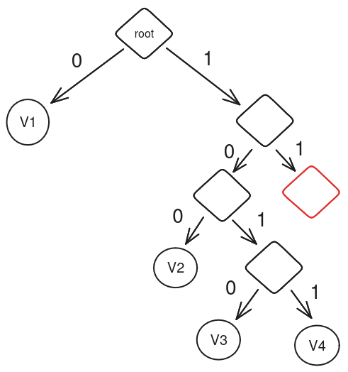
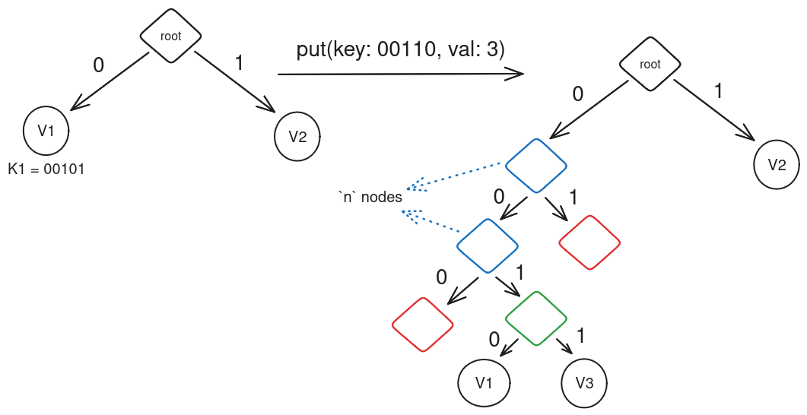

# Nearly Optimal State Merkalization - Specification

## Tree Structure 

We start with a simple Key-Value storage where each key has a fixed size (from now on, the key size will be 32 bytes) and needs to be cryptographically secure. Each state of the storage needs to be described by a unique identifier. The structure that suits the requirements is a **Merkle Patricia Tree**. Each part of the name will be briefly explained. Let's begin with a simple full binary tree in mind where the leaves contain the value related to each key, and all inner nodes are necessary to construct the unique identifier mentioned earlier.

### Merkle

Each node will contain a value, and nodes differ in two categories:
+ leaves: the contained value is the hash of the value or a reference to it
+ internals: the value is the hash of the concatenation of the left and right child's value

### Patricia Tree

As mentioned earlier, values are found in the leaves of the full binary trie, with the key representing the path to reach the value. Considering the key (256 bits), starting from the first bit, each bit determines whether to continue to the left or right child node. Following this process, you will reach a leaf node at the end of the key.

Having a full binary tree is a waste of space, so a sparse binary tree will be used instead. The difference now is that as soon as there is no shared prefix between two values, the tree will stop bifurcating as a binary trie, and that becomes the leaf node. This means that there could be a leaf node at a depth < 256.

If `K` is the key length in bits and `N` is the number of steps needed to traverse the tree to reach the leaf, then: `N <= K`.

#### Basic Operations 

The tree is composed of three possible nodes: Internal, Leaf, and Empty.

- Internal: a node that has two children, left and right (left = 0 and right = 1 in a given bit-key path). Children can be of any type.
- Leaf: a node without children; it contains a value (or a reference to it).
- Empty: This is a special node; it represents the starting point of a non-present path in the Patricia tree.

Given keys of length 5 bits and 4 key-value pairs with keys as follows:

| value | key   |
|:------|:------|
| 1     | 01100 |
| 2     | 11001 |
| 3     | 10101 |
| 4     | 01101 |


The structure of the tree will be:




###### Observations

- Bits that are shared between pairs are represented as internal nodes. If there is nothing shared, the node becomes a leaf. 
- There are no valid nodes under a leaf (it will be explained later why this is so important).
- There can't be internal nodes with one child as a leaf and one empty. The only two valid possibilities are two leaf children or one internal node and one empty.
- Empty nodes can only appear when the sibling is an internal node that has greater than one Leaf below it

#### Get

When we want to retrieve a value given a key, what needs to be done is the following:

```pseudo
    key_pos = 0 // the key path starts from the lsb in the key
    current_node = root
    loop {
       if current_node.is_leaf() 
           return current_node.value 
       else if current_node.is_empty() 
           return current_node // The empty node is returned to simplify the put method
       else 
           if key.at(key_pos) == 0 
               current_node = current_node.left
           else 
               current_node = current_node.right
           key_pos += 1;
    }
```


During the traversal, there are three possibilities:

1. An internal node is found, and the key position in the given key will tell us whether to continue with the left or right child.
2. A leaf is found, and thus this is the ONLY value that has the key as a prefix from zero to the current position in the key. This is the value we are looking for.
3. If an empty node is found, it means that there is no value with the given key.

#### Put

To insert a new key-value pair the first thing that needs to be done is to `get` from the tree the key that needs to be inserted and act upon what is found.

No need to check if the node returned by 'get' is internal since 'get' either returns the value or an empty node at the position where the path stopped being present in the tree. If an empty node is found, it becomes a leaf with the given value.

When a leaf is found, two possibilities arise based on the shared bits between the extracted key (let's call it 'key1') and the key we want to insert (let's call it 'key2') from the stopped key_pos during traversal. If 'get' method returns a leaf for 'key1' and 'key2', there is a shared prefix. 'Key1' is already in the tree, so a section of the shared prefix with 'key2' is also in the tree (internal nodes representing a portion of that prefix).

For example, with keys of 10 bits: 

|      | x      | n  | l  |
|:-----|:-------|:---|:---|
| key1 | 001011 | 11 | 01 |
| key2 | 001011 | 11 | 11 |
    
The keys are divided into three sections - 'x' represents bits already in the tree as internal nodes, 'n' are shared bits that are not in tree, and 'l' are all the bits after a single bit difference.

This division is necessary as, for each 'n' bits, an internal node with an empty child must be created, and one internal node with two leafs for all `l` bits, implicitly showing the difference in 'l' bits.

A special scenario occurs when there are no 'n' bits, and only one new internal node is created.



#### Remove 

To start the removal process, we first use a `get` method. If the retrieved node is empty, no action is required. If the node is a leaf, there are two scenarios:

1. If the sibling of the leaf to remove is an internal node, we simply update the leaf to be empty.

2. If the sibling of the leaf is another leaf (referred to as `sib_leaf`), the following steps are taken:
   - Invalidate the leaf (which contains the value to be removed) and `sib_leaf` making them empty nodes.
   - Traverse all ancestors, invalidating them if their sibling is an empty node.
   - Once an ancestor with a valid sibling is found, replace it with `sib_leaf`.
   
##  How is this stored on disk?

### Pages

Nodes will be split into rootless sub-binary trees of depth `d`, so each group will contain `2^(d+1) - 2` nodes.


We will refer to each group as a *Page*. These pages will construct a **page base-(2^d) tree**, where each Page will have `2^d` child pages below it.

### Node Key and PageIds

A node key represents a `path` in the trie, which is called **KeyPath**. The KeyPath is composed of 256 bits, where each bit defines a fork in the node's tree. When seen as an array of bytes, we traverse from the first byte to the last, with each byte being read from the msb to the lsb. For example, if `KeyPath = [0b01001001, 0b00010000]`, the first byte will be `0b01001001` and the first bit to traverse the tree will be `0` (msb), followed by `1` and so on, with the last bit in the byte being `1` (lsb).

Each page contains a rootless sub-binary tree; hence, the KeyPath can be divided into multiple segments that reference the path in the each page sub-tree. These segments are called **d_tets**. For instance, with `KeyPath = [0b01001001, 0b00010000]` and `d = 4`, the `d_tet` will be `[0b0100, 0b1001, 0b0001, 0b0000]`.

Each d_tet specifies the page table to move to next from the previous one, starting from the root page.

If d is a divisor of the key length, there will be `(256/d) - 1` d_tets, each 'd'-bits long; otherwise, there will be `⎣256/d⎦`. This is because the remaining bits are used to traverse the last page and are not required to access any new page.

Each page is assigned a unique identifier (**PageId**) created by the d_tets necessary to reach that page.

###  From KeyPath to Pages

Given a Node Key, we can treat it as an array of bits and split it into `256/d` d\_tets. Iterating over all the d\_tets we will construct each needed PageId to fetch all the Pages that will store the path of the KeyPath.

Let's call `dtets` the array containing all d\_tets and `page_ids` the array of all needed page_ids we want to fill. All PageId will be constructed like this:

```pseudo
    for i in dtets.len() 

        if i > 0 
             prev_page_id = page_ids[i - 1]
         else 
            prev_page_id = 0
            
        page_ids[i] = (prev_page_id << d) + int(dtets[i]) + 1
```

where `int(dtets[i])` just mean to treat as an integer the sequence of `d` bits and `(prev_page_id << d)` is equal to `(prev_page_id * 2^d)`.

And here's how we can deterministically get the value and all the parent nodes in Merkle from the pages identified by the PageIds extracted from the KeyPath.

### Rootless sub-binary tree in Page
 
A Page is just an array of bytes that will contain a rootless sub-binary tree, thus an array of Nodes.

#### Node

Each node will consist of 32 bytes, with the most significant bit (msb) determining whether the node is an internal node (0 as msb) or a leaf (1 as msb). A node with 32 bytes of all zeros is a special node called the empty node.

Internal nodes will store the hash of the concatenation of the hashes of its children. The children can be internal nodes, in which case their hashes are used; they could also be empty (using 32 bytes of zeros), or they could be leaves, in which case the hash of the value is used.

#### Node Layout Within Pages 

Each node in the rootless sub-binary tree is assigned a position. The root is assigned position 1, and at each subsequent level, the identifiers increase from left to right. For example:


A node at position `p` in the tree will be stored in the array at index `p - 1`. Since it is rootless, `p` will always be greater than 1. The children of a node at position `p` will be at positions `p * 2` and `(p * 2) + 1`, corresponding to the left and right child nodes, respectively.

All nodes that are not leaves or internal nodes are empty when viewed from a page perspective. However, it is possible to access only few of them respecting the constraints outlined in the previous section.
